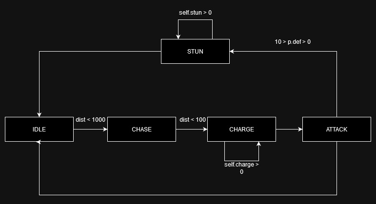

# Overview
2D minigame inspired by Dark Souls, Sekiro and Hollow Knight in Metroidvania style.

# Table of Contents
- [Description](#description)
- [Installation](#how-to-install-and-run)
- [Usage](#how-to-use)
- [Updates](#updates-and-features)
- [Bugs](#bugs-and-issues)

# Description
After executing script window(1336x768) will be created with simple ui and 2 game objects. \
User interface consists of 3 bars tracking players hp, mana and stamina and 2 slots tracking players equipped items. Another hp bar at the bottom displays hp of second game object. \
Object on the left (player) is controlled by [keyboard and mouse](#how-to-use). \
Object on the right (enemy) is dirven by simple "AI" (FSM with lot of conditions). \

In __/objs__ folder there are 2 types of enemies. \
 - /objs/enemy.py  - simple enemy with 3 states and one type of attack pattern. Very predictable and easy to defeat. \
 
 - /objs/boss.py   - refined enemy with multiple states, multiple types of attacks, driven by random number generators and more complex FSM. \
 
# How to Install and Run
Download or clone this repository
```
git clone https://github.com/rm-a0/2d-souls
```
Install pygame
```
sudo apt install pygame
```
Run using
```
./main.py
```

# How to use
> [!NOTE]
> Rebinding is not implemented yet
> You can rebind keys manually in main.py

### List of Keybinds
| Keys                      | Actions                                       |
|---------------------------|-----------------------------------------------|
| `A`                       | Move left (backward)                          |
| `D`                       | Move right (forward)                          |
| `[Space]`                 | Jump                                          |
| `[L-Shift]`               | Dash                                          |
| `[L-MButton]`             | Attack                                        |
| `[R-MButton]`             | Deflect                                       |
| `E`                       | Heal (Will be switched to Use Slot 1)         |
| `Q`                       | Use Slot 2                                    |

# Updates and Features
- [x] Basic interface (bars, item slots, icons)
- [x] Classes and methods for game objects
- [x] Weapon class and methods
- [x] More constants, erase magic numbers
- [x] Refined UI elements and classes
- [x] Slot tracking method
- [x] Attacks and deflects stop movement briefly
- [x] Added enemy AI prototype
- [x] Added simple AI for enemies
- [ ] Weapon hitbox refinement
- [ ] Windup for enemy attack
- [ ] Secondary attack for enemies
- [ ] Dummy surface
- [ ] Tilemap

# Bugs and Issues
- [x] Jumping feels clunky and non responsive in some scenarios
- [x] When enemy is defeated coordinates still exist and bar updating crashes
